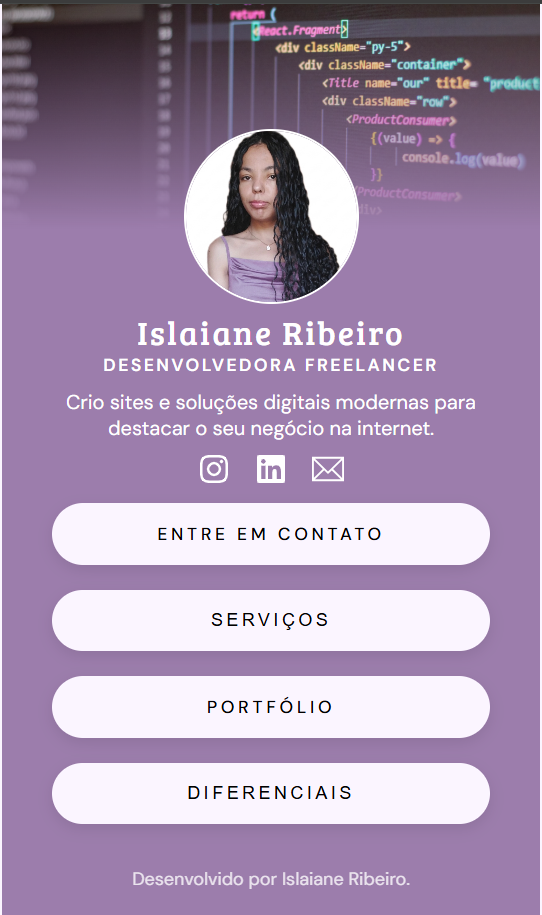
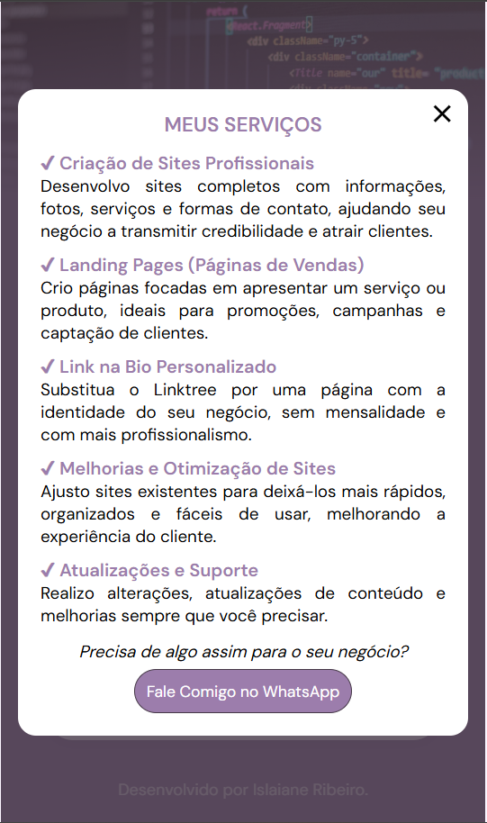
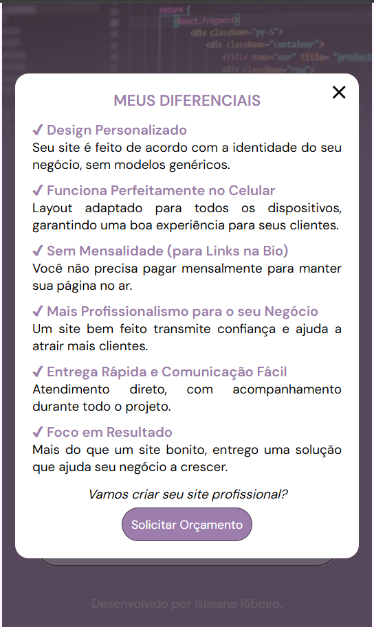

# 🔗 Link na Bio Profissional

Aplicação web desenvolvida para centralizar contatos, serviços e portfólio em uma única página, com foco em **apresentação profissional, conversão de clientes e experiência mobile**.

Este projeto funciona como uma alternativa personalizada a ferramentas como agregadores de links, oferecendo **mais identidade visual, flexibilidade e profissionalismo** para quem deseja se destacar online.

**Tipo de projeto:** Projeto autoral desenvolvido como vitrine digital para serviços freelance.

<div align="center">
  
  
  
</div>

Acesse o projeto: https://islaiane-dev.vercel.app/

---

## 🎯 Proposta do Projeto

Criar uma página simples, rápida e estratégica que:

- Apresente serviços de forma clara e objetiva;
- Gere confiança no primeiro contato;
- Direcione o usuário para ação (WhatsApp);
- Funcione perfeitamente em dispositivos móveis;
- Reforce identidade profissional.

---

## ✨ Principais Destaques

- Interface **mobile-first** focada em conversão;
- Estrutura **modular e reutilizável com React**;
- Uso de **TypeScript** para maior confiabilidade;
- Componentes reutilizáveis (Button, Modal);
- Conteúdo dinâmico com base em estrutura de dados;
- Design limpo com foco em leitura e usabilidade.

---

## 📌 Funcionalidades

### Tela Inicial

- Apresentação profissional com foto e descrição;
- Links diretos para contato e navegação;
- Interface otimizada para redes sociais.

### Modal de Serviços

- Lista estruturada com títulos e descrições;
- Clareza na comunicação dos serviços oferecidos;
- Conteúdo pensado para facilitar decisão do cliente.

### Modal de Diferenciais

- Destaque para benefícios e valor entregue;
- Reforço de credibilidade e posicionamento profissional;
- Comunicação objetiva e estratégica.

### Experiência do Usuário

- Interface minimalista e intuitiva;
- Navegação simples e direta;
- Layout responsivo;
- Interações suaves com foco em usabilidade.

---

## 🛠️ Tecnologias Utilizadas

- **React.js** — construção da interface;
- **TypeScript** — tipagem e segurança;
- **CSS3** — estilização e responsividade;
- **Vite** — ambiente de desenvolvimento;
- **React Icons** — ícones;
- **Google Fonts** — tipografia.

---

## 🧠 Organização do Código

Estrutura de pastas e arquivos do projeto:

```
📁 src
├─ 📁 assets             # Imagens do projeto (capa, perfil, etc.)
│
├─ 📁 components         # Componentes reutilizáveis
│  ├─ Button.tsx
│  ├─ Modal.tsx
│  ├─ Profile.tsx
│  ├─ SocialLinks.tsx
│
├─ 📁 data               # Dados estáticos utilizados na aplicação
│  └─ ModalData.ts
│
├─ 📄 App.tsx            # Componente principal da aplicação
├─ 📄 main.tsx           # Ponto de entrada do React
├─ 📄 index.css          # Estilos globais
├─ 📄 app.css            # Estilos específicos da aplicação
```

---

## 🛠️ Como Rodar o Projeto Localmente

1. Clone o repositório:

```bash
git clone https://github.com/islaianeribeiro/link-in-bio-template.git
```

2. Acesse a pasta do projeto:

```bash
cd link-in-bio-template
```

3. Instale as dependências:

```bash
npm install
```

4. Inicie o servidor de desenvolvimento:

```bash
npm run dev
```

5. Abra no navegador o endereço exibido no terminal (geralmente `http://localhost:5173`)

---

## 🔧 Possíveis Evoluções

- [ ] Animações mais avançadas (UX mais refinada);
- [ ] Tema claro/escuro;
- [ ] Versão reutilizável para múltiplos clientes;
- [ ] Painel simples para edição de conteúdo.

---

## 🧠 Aprendizados

Este projeto reforça na prática:

- Componentização com React;
- Tipagem com TypeScript;
- Organização e escalabilidade de código;
- Criação de interfaces com foco em usuário;
- Estruturação de projetos voltados para negócio.

---

## 💼 Aplicação no Mercado

Este tipo de solução pode ser utilizado por:

- Pequenos negócios;
- Profissionais autônomos;
- Criadores de conteúdo;
- Prestadores de serviço.

Como uma alternativa mais profissional e personalizada a ferramentas prontas.

---

## 👩‍💻 Desenvolvido por

**Islaiane Ribeiro**
Desenvolvedora Front-End

🔗 LinkedIn: [https://www.linkedin.com/in/islaianeribeiro](https://www.linkedin.com/in/islaianeribeiro)

---

## 📄 Licença

Este projeto está sob a licença MIT.

⚠️ O conteúdo e identidade visual são de uso pessoal e não devem ser reutilizados sem autorização.
